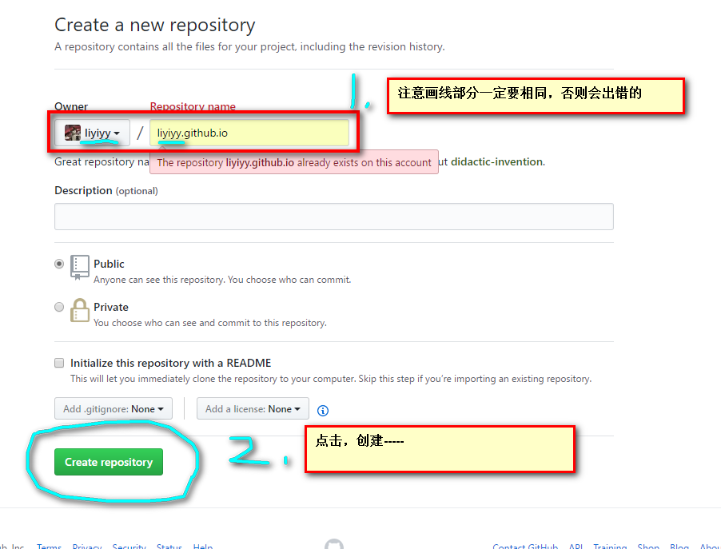
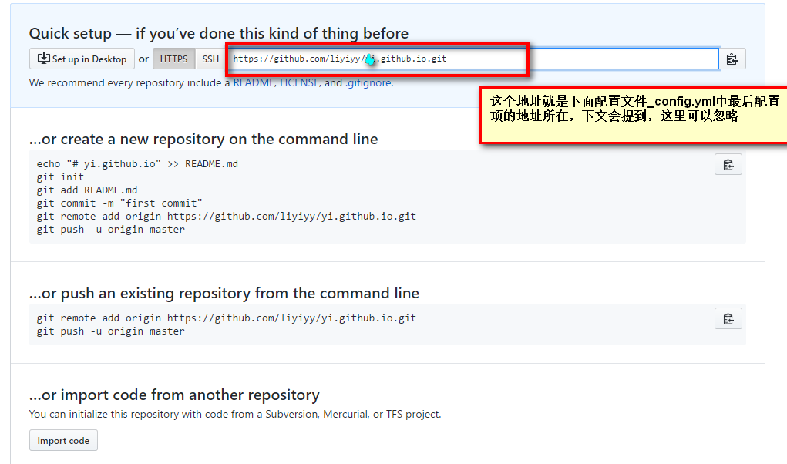
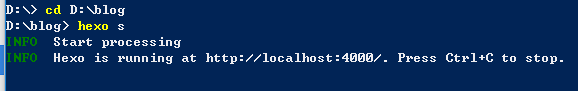
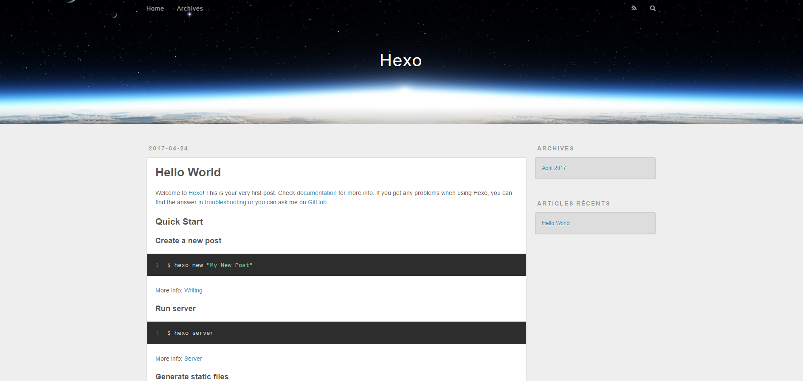
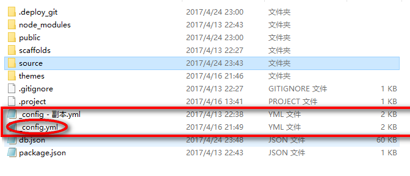
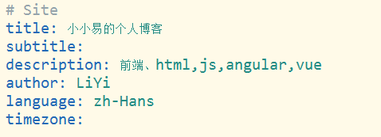
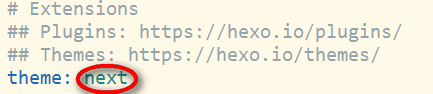
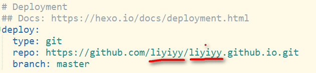
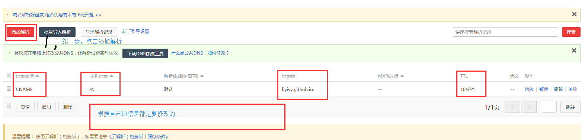

1、先看成果----
[Miss·易](http://liyiyy.com/)

2、工具+版本
    npm   3.10.8
    git Shell

3、开始
    1),先从简单的开始；
    先去github里创建一个repository;如图;
    
    创建后的页面
    
    
```
$ npm install hexo-cli -g       //打开git命令行，执行第一行命令安装Hexo，注意；我所实践中发现；npm命令可以在git中用，但反过来不行
```
```
$ hexo init blog   //初始化博客文件，我的博客的本地文件夹名就是blog；但是建议与github仓库命一样，例如我的就是liyiyy.github.io
```
```
$ cd blog       //进入到刚创建好的blog中,执行下一步
```

```
$ hexo server     //  开启服务
```
当出现如下图所示时：
[link](github-hexo搭建个人静态博客（一-搭建）/2017-04-24_233958.png)
在浏览器中输入localhost:4000就可以访问本地的博客了,就可以看见一个简单的博客就基本成型了，看成果。。。



    2）修改主题，配置等
先下载主题，我用的是next主题

```
$ git clone https://github.com/iissnan/hexo-theme-next themes/next
```


下载好后就来修改根目录下的_config.yml文件，为了防止改错，可以先备份一份，打开这个文件时最好用常用的编辑器打开，方便查看，用记事本打开完全乱掉

==修改时还要注意，属性冒号后面要空一格再写值，否侧会出错==

a),修改个人信息


b),修改主题信息，将原来的主题删掉，改成下载的next主题；

c),重点，上传到github上的配置；只要将地址改成你自己的就行了；地址上面有提到过


   
    3）执行命令上传
    hexo clean
    hexo g
    hexo d
    
上传成功后就可以在浏览器中输入你的网址了，例如我的；liyiyy.github.io 就可以看见已经成功了

4） 绑定自己的域名
a).先去买个域名，我的是在阿里云上买的；然后解析域名，添加解析记录，如：


b).在source文件夹下创建CHAME文件(为什么要在source文件夹下写，是为了以后上传文件时避免覆盖，不要后缀，可以用cmd黑窗口命令行创建，也可以用编辑器创建；里面只需要写域名就好了例如我的就是liyiyy.com，不需要写WWW;

好了过段时间，就可以打开你的域名访问了
打开我的---liyiyy.com
成功！

=========================途中所遇到的问题=========================

1,本地测试成功，上传到github后不能打开？
    这里卡壳了好多天，上传上去后一直会给我发邮件说创建页面失败，后面按照简洁的做法，没有先安装主题，直接初始化后就上传了，然后也没出问题，后来仔细阅读邮件后发现可能是主题安装的版本与github上的东西不兼容。
    
2，绑定域名的时候绑定成功了，但就是不显示内容，整个页面只有EOF？
    之前一直是在手机上解析域名的，也没有报什么原因，在电脑上解析的时候报出出错原因是域名冲突了，刚注册的域名会有很多的解析的东西，后来没办法，简单粗暴的把其他的直接删除了，没出问题了；不知道这有什么不妥；

3，发现局限性不知道怎么破？
    在本地添加的图片在部署后不会显示出来；用github图片的链接也没用；
    