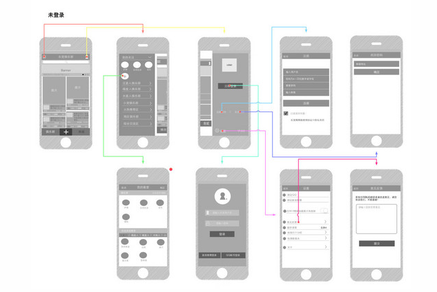
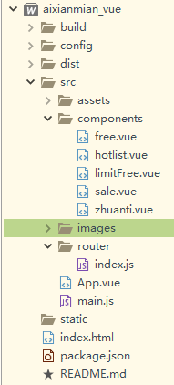

### 从0到1怎么做的流程，产品-设计-前端-后端-测试-上线等


1、在项目立项时，所有相关人员（产品、UI、前端、后端、测试）开产品会议，产品会根据市场调研分析、市场需求、产品定位、盈利模式等给出需求说明书和设计出原型图。讨论具体的功能模块和跳转逻辑，一起讨论交流原型，不足之处进行改进完善。

2、UI会根据开会内容设计出效果图，然后开会开发人员这边还需要根据需求和所掌握的技术讨论采用什么开发框架。UI设计出效果图给产品，产品还会跟客户交涉，看是否效果图能达到客户预期。达到预期后，就会开始分工合作。
项目原型图：
；
4、各类的方案通过后，就根据任务安排 评估项目所需要的时间。评估出 产品、UI、前端、后端、测试的开发时间，找到最节省时间、效率最高的的开发方案。
5，UI将设计好的图给前端，前端开始用模拟的数据写静态的页面，并同后台商量需要的数据格式；让后端写数据并写好接口给前端人员，并给出接口文档说明书；
6，接口和静态页面写好后就要前后台联调，跑通后就交付给测试人员去测试，生产环境测试，开发环境测试；然后反馈修改，最后通过项目模拟上线测试就可以上线了。
 
### 用vue搭建项目流程-从0-1——aixianmian_vue 框架搭建
##### demo示例：
注意：vue分为单页面和多页面应用之分，项目比较小的就用单页面应用，项目大就用多页面应用。只是搭建个小的demo,单页面就搞定了。
项目的 vue2.0 + vue-cli + webpack + vue-router2.0

1.安装Vue2.0
```
npm install vue
```
2.安装vue-cli 脚手架工具
```
npm install --global vue-cli
```
3.在某个目录下，创建一个基于 webpack 模板的新项目
```
vue init webpack my-project			//my-project是你的项目名
```
4.安装依赖
```
cd my-project  //到项目目录下
npm install  //安装依赖
```
6.运行vue项目
```
npm run dev		//一个简单的vue项目就好了
```
7.安装路由
```
npm install vue-router 
```

##### 基础的安装工作就做好了，下面开始来写配置和代码
1，项目整体目录目录：
；
单页面应用主要写代码的部分在src文件夹下,组建部分在的components的以Vue结尾的文件中；
2，路由 部分在router下的index.js中配置 ；vue的引入、输出的语法是参ES6的语法，用import引入，export输出。
```
import Vue from 'vue'
import Router from 'vue-router'
import LimitFree from '@/components/limitFree'
import Free from '@/components/free'
import Zhuanti from '@/components/zhuanti'
import Hotlist from '@/components/hotlist'
import Sale from '@/components/sale'

Vue.use(Router)

export default new Router({
  routes: [
    {
      path: '/LimitFree',
//    name: 'Hello',
      component: LimitFree
    },
    {
      path: '/Free',
//    name: 'Hello',
      component: Free
    },
    {
      path: '/Zhuanti',
//    name: 'Hello',
      component: Zhuanti
    },
    {
      path: '/Hotlist',
//    name: 'Hello',
      component: Hotlist
    },
    {
      path: '/Sale',
//    name: 'Hello',
      component: Sale
    },
    {
      path: '*',
      redirect: '/LimitFree'
//    name: 'Hello',
    }    
  ]
})
```
3，vue在2.0版本中的组件模板需要一个外围标签包裹，否则会报错。
```
<template>
  <div id="limitFree">
  	要用一个div 包裹住；现在   在这块就可以正式开始你的代码了；
  </div>
</template>
<style>
	写组建的样式
</style>
<script>
	写组建的处理代码
</script>
```
4，组件传值完整示例；父级传给子级，子级传给父级，同级之间的传值；
```
<!DOCTYPE html>
<html>
	<head>
		<meta charset="UTF-8">
		<title></title>
		<script src="vue2.0/vue.js"></script>
	</head>
	<body>
		<div id="app">
			<aaa></aaa>
			<hr />
			<bbb></bbb>
			<hr />
			<ccc></ccc>
		</div>
		
		<script>
			//创建一个空的vue实例，专门用来处理组件于组件之间通信的事件
			var myEvent = new Vue();
		
			var aCom = {
				template: `
					<div>
						<h1>这是a组件</h1>
						<p>{{msg}}</p>
						<button @click='sendMsg()'>将数据给c</button>
					</div>
				`,
				data(){
					return {
						msg: '这是a的数据'
					}
				},
				methods: {
					sendMsg(){
						myEvent.$emit('a-send', this.msg, 123);
					}
				}
			}
			
			var bCom = {
				template: `
					<div>
						<h1>这是b组件</h1>
						<p>{{msg}}</p>
						<button @click='sendMsg()'>将数据给c</button>
					</div>
				`,
				data(){
					return {
						msg: '这是b的数据'
					}
				},
				methods: {
					sendMsg(){
						//发送数据
						myEvent.$emit('b-send', this.msg)
					}
				}
			}
			
			var cCom = {
				template: `
					<div>
						<h1>这是c组件</h1>
						<p>这是从a组件接收的:{{aMsg}}</p>
						<p>这是从b组件接收的:{{bMsg}}</p>
					</div>
				`,
				data(){
					return {
						aMsg: '111',
						bMsg: ''
					}
				},
				mounted(){
					
					//接收事件
					myEvent.$on('a-send', function(data1, data2){
						console.log(data1)
						this.aMsg = data1;
						console.log(this.aMsg)
					}.bind(this))
					
					myEvent.$on('b-send', function(data){
						console.log(data)
						this.bMsg = data
					}.bind(this))
					
				}
			}
			
			
			var vm = new Vue({
				el: '#app',
				components: {
					'aaa': aCom,
					'bbb': bCom,
					'ccc': cCom
				}
			})
			
			
			
			
			
		</script>
		
		
	</body>
</html>
```

